# Methodical Splitting
An algorithmic method for splitting the dataset into training and validation sub-datasets, making sure that the dis-tribution for the dataset is maintained.

## Introduction
Machine learning models usually perform well when trained on hand-split prepared datasets, but not in real-world datasets, where the preparation for the training, validation and testing sub-datasets requires extensive effort, thus, random splitting is chosen which compromises the fair representation of the features and categories within the dataset. An algorithmic method is proposed, for fairly splitting the dataset, in order to maintain unbiased features and categories representation. The algorithm splits each dataset into sub-datasets after reducing the dimension, in order to be clustered afterwards. Different datasets and multiple models are used for performance evaluation.

## Methodical Splitting Algorithm	
In this research, an algorithmic method is proposed for fairly splitting the dataset into training and validation sub-datasets, making sure that the distribution for the dataset is maintained. Achieving this requires going through major steps.
<ol>
  <li>Dimension reduction and high level clustering</li>
  <li>Splitting the clustered dataset into three separate ranges</li>
  <li>Splitting each cluster ranges into (train & valid), then concatenating train & valid sub-datasets</li>
</ol>

## Experiments

### Datasets
The first step of this work is to choose the datasets which are examined, taking in consideration the variety of complexity between them, in order to increase the confidence degree in the results, and to avoid false conclusions. For this five different datasets are used, which vary in complexity, in terms of dimension, size, and labeling.
* MNIST: consists of total 70000 handwritten of 10 digits categories (from 0 to 9), the size of each image is 28x28 pixel.
* Fashion-MNIST: consists of total 70000 grey scaled images of 10 fashion categories, the size of each image is 28x28 pixel.
* Cifar-10: consists of total 60000 colored images of 10 objects categories, the size of each image is 32x32 pixel.
* Small NORB: consists of 48600 images of 50 toys which are divided on 5 object categories, the size of each image is 96x96 pixel. The dataset is labeled with other labels, however, the object label is used.
* Shapes3d: 60000 images are used, the dataset is labeled with multiple labels, however shape label is considered which contains 4 categories, the size of each image is 32x32 pixel.

#### Datasets
<table>
  <tr>
     <td>MNIST</td>
     <td>Fashion-MNIST</td>
     <td>Cifar-10</td>
     <td>Small NORB</td>
     <td>Shapes3d</td>
  </tr>
  <tr>
    <td>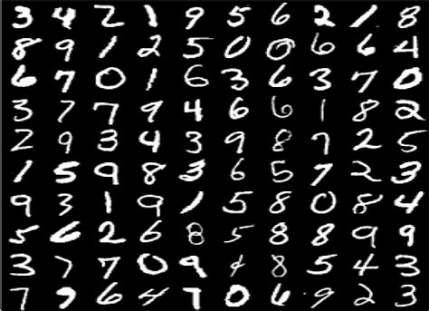</td>
    <td>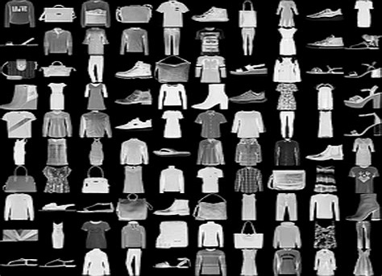</td>
    <td>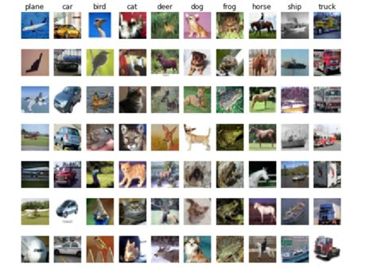</td>
    <td>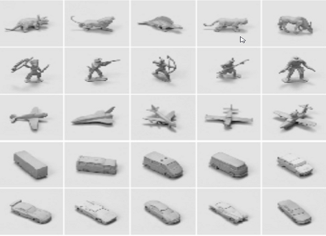</td>
    <td>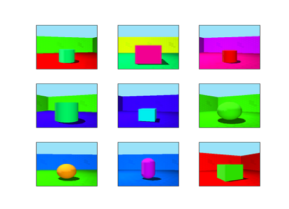</td>
  </tr>
 </table>

### Dimension reduction and high level clustering:
This step consists of two sub-steps, the first is the dimension reduction into 2-dimension for data preparation prior to the clustering. The next step is the 1-dimension reduction from the original data on the resulted clusters. For dimension reduction Umap is used, while HDBSCAN and GMM (n_components = 10) are applied for the high level clustering.

#### MNIST Dimension reduction
<table>
  <tr>
     <td>Reduced dimension clustering (MNIST 1D)</td>
     <td>Reduced dimension clustering (MNIST 2D)</td>
  </tr>
  <tr>
    <td>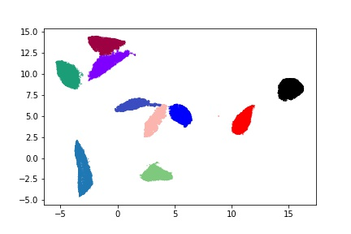</td>
    <td>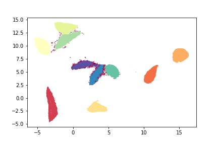</td>
  </tr>
 </table>

### Data splitting:
Quantile is used to specify the cut points and to split the regions among the dataset in to three main ranges, median range, quartile range, and extreme range, using the parameters β, α1, α2 respectively.

#### Small NORB split (3 ranges - Extreme experiment)
<table>
  <tr>
     <td>Median range</td>
     <td>Quartile range</td>
     <td>Extreme range</td>
  </tr>
  <tr>
    <td>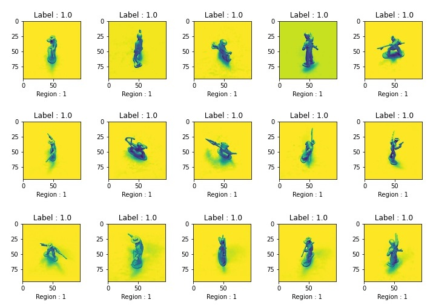</td>
    <td>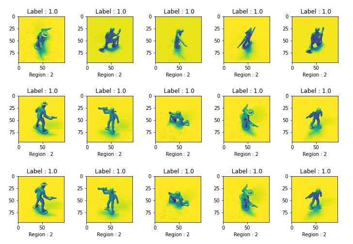</td>
    <td>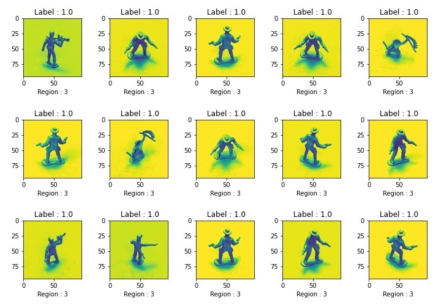</td>
  </tr>
 </table>

### Models:
The following three models are trained and tested. In each experiment a pre-trained model is used, the top of the model is replaced with dense layer (relu activation is used), then followed by another dense prediction layer (softmax activation is used). Hence, the pre-trained models parameters are kept.  Categorical cross entropy is used for model loss, and it is optimized by Adam optimizer.:
* VGG
* ResNet
* Inception

### Metrics and evaluation:
* Accuracy
* Precision
* Recall
* F1-Score
* Hamming loss

### Experiments groups:

All the following experiment groups are performed on the previously mentioned datasets using the three models and the two clustering methods, in overall we have more than one hundred and eighty different experiments.

* Ground truth experiments (original sub-datasets):
In this experiment the pre-split (so called: original split, hence the name) after loading the dataset is used, hence, train and test. Shapes3d dataset is excluded, since there is no pre-split for this dataset.

* Model training on random sub-datasets:
In case of Shapes3d dataset, the loaded dataset is randomly split into train and test sub-datasets after shuffling. For other datasets, pre-split sub-datasets are concatenated first.

* Special case experiment:
Special scenario is simulated, where the test sub-dataset is held out before hand, then the splitting is applied on the other proportion, then the data from the median range is considered as training sub-dataset, and the concatenated data from quartile and extreme ranges is considered as validation sub-dataset.
This scenario is simulated, to replicate the case when the model is trained on "clean" data (from median range), but it is tested on mixed data (held out sub-dataset).
		  
* Extreme experiment:
Extreme scenario is introduced, where we may find feature biasing in a split, either training, validation or testing, for instance, outlier crowds in testing dataset.
One scenario is considered, where the training data is data from the median range, the validation data is from quartile range, and testing is from extreme range. The model is trained on "clean" data, validated on data contains oddity, and tested on anomaly data.
		  
* Methodical Splitting experiment:
In this experiment, we apply the proposed algorithm, where the test data is held out beforehand.

		  
  | Experiment  | α1  | α2  | β | 
  | ---------- | ----------  | ----------  | ----------  |
  | 4  | 35%   | 55%   | ≤10%  |
  | 7  | 45%   | 40%   | ≤15%  |
  | 12  | 35%   | 45%   | ≤20%  |

## Experiments guide:
All experiments are performed in Google Colab GPU environment. Sample experiments for the <a href="#experiments-groups">Experiments groups</a> are listed below.

### Notebooks structure:
Each experiment notebook goes throught the following steps:
<ol>
  <li>Cloning "Methodical Splitting" repo and importing "ExpModel.py" & "Functions.py" files</li>
  <li>Asking for the experiment details: group, exp_number, dataset, used model, and split regions (if applicable)</li>
  <li>Importing the data, and performing concatenation & splitting (if applicable)</li>
  <li>Dimension reduction & high level clustering (if applicable)</li>
  <li>Data splitting, e.g. Deploying Methodical Splitting algorithm (if applicable)</li>
  <li>Model buidling and training</li>
  <li>Results recording (into ".xlsx" file)</li>
</ol>

### Sample notebooks:
* The sample note books are the following:
<ol>
  <li><a href="./notebooks/groundTruth/FashionMNIST/VGG/Group_GroundTruthExp/Exp0/">GrounTruth experiment</a> (original split): Fashion-MNIST dataset.</li>
  <li><a href="./notebooks/random/FashionMNIST/VGG/Group_RandomExp/Exp0/">Random experiment</a> (random split): Fashion-MNIST dataset.</li>
  <li><a href="./notebooks/hdbscan/MNIST/VGG/Group_1/Exp4/">Methodical Splitting experiment</a> (only Group_1 is included, becasue Group_2 & Group_3 have the same structure): MNIST dataset, HDBSCAN, VGG model.</li>
  <li><a href="./notebooks/hdbscan/SmallNorb/Inception/Group_6/Exp16/">Special case experiment</a> (Group_6): Small NORB dataset, HDBSCAN, Inception model.</li>
  <li><a href="./notebooks/gmm/Shapes3D_shape/ResNet/Group_7/Exp20/">Extreme experiment</a> (Group_7): Shapes3D dataset, GMM, ResNet model.</li>
</ol>

	
### Experiments Groups
 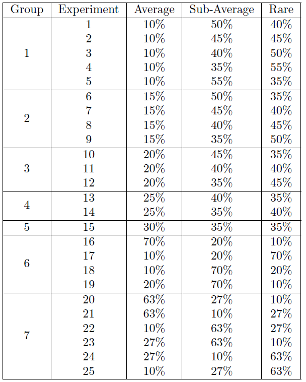 

		  
# License
<a href="./LICENSE">MIT License</a>.
